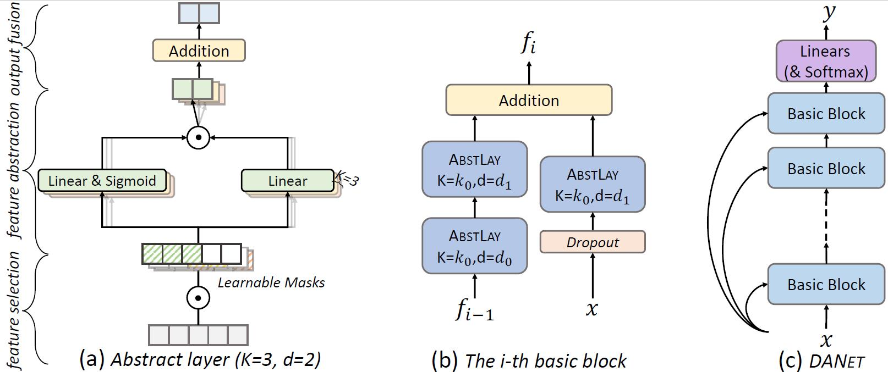

# Deep Abstract Networks
A PyTorch implementation of AAAI-2022 paper **[DANets: Deep Abstract Networks for Tabular Data Classification and Regression](https://arxiv.org/abs/2112.02962)** for reference.

## Brief Introduction
Tabular data are ubiquitous in real world applications. Although many commonly-used neural components (e.g., convolution) and extensible neural networks (e.g., ResNet) have been developed by the machine learning community, few of them were effective for tabular data and few designs were adequately tailored for tabular data structures. In this paper, we propose a novel and flexible neural component for tabular data, called Abstract Layer (AbstLay), which learns to explicitly group correlative input features and generate higher-level features for semantics abstraction. Also, we design a structure re-parameterization method to compress AbstLay, thus reducing the computational complexity by a clear margin in the reference phase. A special basic block is built using AbstLays, and we construct a family of Deep Abstract Networks (DANets) for tabular data classification and regression by stacking such blocks. In DANets, a special shortcut path is introduced to fetch information from raw tabular features, assisting feature interactions across different levels. Comprehensive experiments on real-world tabular datasets show that our AbstLay and DANets are effective for tabular data classification and regression, and the computational complexity is superior to competitive methods.

## DANets illustration


## Downloads  
### Dataset  
Download the datasets from the following links:
- [Cardiovascular Disease](https://www.kaggle.com/sulianova/cardiovascular-disease-dataset)
- [Click](https://www.kaggle.com/c/kddcup2012-track2/)
- [Epsilon](https://www.csie.ntu.edu.tw/~cjlin/libsvmtools/datasets/binary.html)
- [Forest Cover Type](https://archive.ics.uci.edu/ml/datasets/covertype)
- [Microsoft WEB-10K](https://www.microsoft.com/en-us/research/project/mslr/)
- [Yahoo! Learn to Rank Challenge version 2.0](https://webscope.sandbox.yahoo.com/catalog.php?datatype=c)
- [YearPrediction](https://archive.ics.uci.edu/ml/datasets/yearpredictionmsd)

(Optional) Before starting the program, you may change the file format to `.pkl` by using `svm2pkl()` or `csv2pkl()` functions in `./data/data_util.py`.

## How to use

### Setting  
1. Clone or download this repository, and `cd` the path.
2. Build a working python environment. Python 3.7 is fine for this repository.
3. Install packages following the `requirements.txt`, e.g., by using `pip install -r requirements.txt`.

### Training
1. Set the hyperparameters in config files (`./config/default.py ` or `./config/*.yaml`).  
   Notably, the hyperparameters in `.yaml` file will cover those in `default.py`.

2. Run by `python main.py --c [config_path] --g [gpu_id]`.
    - `-c`: The config file path
    - `-g`: GPU device ID
3. The checkpoint models and best models will be saved at the `./logs` file.
    
### Inference 
1. Replace the `resume_dir` path with the file path containing your trained model/weight.
2. Run codes by using `python predict.py -d [dataset_name] -m [model_file_path] -g [gpu_id]`.
    - `-d`: Dataset name
    - `-m`: Model path for loading
    - `-g`: GPU device ID

### Config Hyperparameters
#### Normal parameters
- `dataset`: str  
   The dataset name given must match those in `./data/dataset.py`.
     
- `task`: str  
   Choose one of the pre-given tasks 'classification' and 'regression'. 
     
- `resume_dir`: str  
   The log path containing the checkpoint models.  
     
- `logname`: str  
   The directory names of the models save at `./logs`.
  
- `seed`: int  
   The random seed.
  
#### Model parameters
- `layer`: int (default=20)  
   Number of abstract layers to stack
  
- `k`: int (default=5)  
   Number of masks

- `base_outdim`: int (default=64)  
   The output feature dimension in abstract layer.
   
- `drop_rate`: float (default=0.1)  
   Dropout rate in shortcut module
  
#### Fit parameters
- `lr`: float (default=0.008)  
   Learning rate
  
- `max_epochs`: int (default=5000)  
   Maximum number of epochs in training.
  
- `patience`: int (default=1500)  
   Number of consecutive epochs without improvement before performing early stopping. If patience is set to 0, then no early stopping will be performed.  
  
- `batch_size`: int (default=8192)  
   Number of examples per batch.
  
- `virtual_batch_size`: int (default=256)  
   Size of the mini batches used for "Ghost Batch Normalization". `virtual_batch_size` must divide `batch_size`.

### Citations
```
@inproceedings{danets, 
   title={DANets: Deep Abstract Networks for Tabular Data Classification and Regression}, 
   author={Chen, Jintai and Liao, Kuanlun and Wan, Yao and Chen, Danny Z and Wu, Jian}, 
   booktitle={AAAI}, 
   year={2022}
 }
 ```


